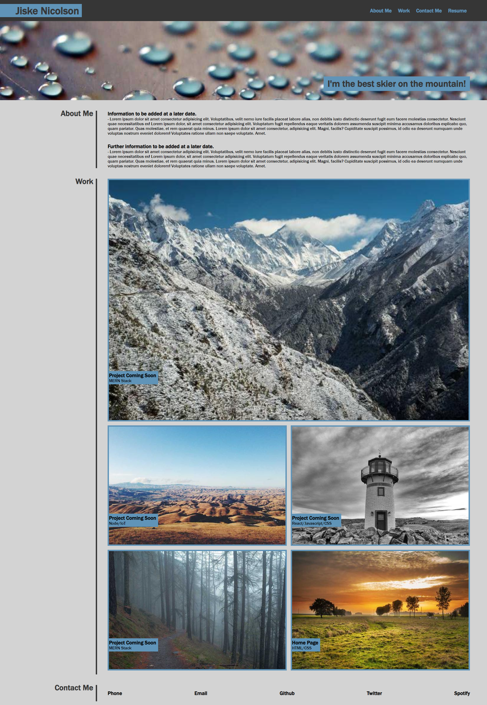

# Portfolio Page

## Link & Contents
- [The Deployed Portfolio](https://jiske-n.github.io/Jiske-N-Portfolio/)
- [Further Goals](#further-goals)
- [Potential Issues/Improvements](#potential-issuesimprovements)
- [Key Learnings](#key-learnings)
- [Contributing and Feedback](#contributing-and-feedback)
- [Credits](#credits)
- [License](#license)

## The Portfolio

This page was designed as a platform to host:
-Contact details about myself as well as links to some other sources that tell the user a bit more about me.
-A bio with some backgroung information about me.
-Links to previous deployed projects I've made to show my skills as a developer.

Goals included, putting in as many semantic elements as possible and following best practices for html and css formatting and order.

- [The Deployed Portfolio](https://jiske-n.github.io/Jiske-N-Portfolio/)

## Further Goals

Other goals include:
-Writing a good README.
-Ensuring all graphical elements have alternative text descriptions.
-Having the page elements resize smoothly and neatly when changing screen size.
-Ensuring commenting is comprehensive and in place for ease of future alteration.
-Have all elements of the page working without errors.
-Include features such as @media queries and :hover affects.

## Potential Issues/Improvements

Added query/s to the html with potential improvements to address issues below:

- Seemingly slow and clunky loading sequence(might just be my poor internet).
- Consider alternate name for the page.
- Obviously completing/updating content in the future.

## Key Learnings

The biggest learning points and hurdles I faced revolved around getting items to display properly how I wanted them to with flex and getting elements to behave properly with changing screen sizes.

Other learnings include:
- Further definition and application of semantic elements.
- Applying shadow properties to an element.
- Improving flow and structure of selectors in css.
- The use of rem as a unit.

## Contributing and Feedback

If you find any issues or have contributions or feedback you can do so by opening an [issue](https://github.com/Jiske-N/challenge-1/issues) on Github.

## Credits

All background images sourced from Picsum (photos all from https://picsum.photos)

## License

None presently.